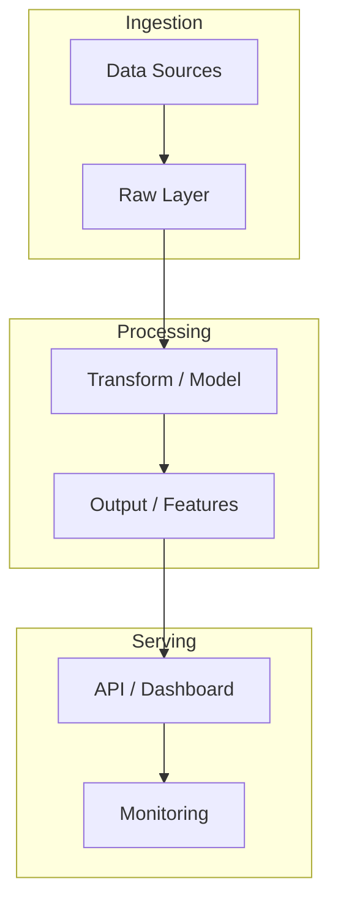

# ai-financial-copilot

> Multi-agent RAG system with tool-calling and episodic memory for autonomous financial analysis. DeepEval tested, LangSmith traced. Context recall >87%, faithfulness >0.85.

**Stack:** AWS/GCP · Vector DB · LangGraph · Claude API · FastAPI · Memory · Docker · DeepEval · LangSmith

**KPIs:** Context recall >87% · Faithfulness >0.85 · DeepEval tested

---

## Problem Statement

<!-- Describe the business problem this project solves -->

## Architecture



## Tech Decisions & Trade-offs

| Decision | Choice | Reason |
|----------|--------|--------|
|          |        |        |

## Results

| Metric | Value |
|--------|-------|
| KPI 1  | —     |
| KPI 2  | —     |

## How to Run

```bash
git clone https://github.com/lcarrenoy/ai-financial-copilot.git
cd ai-financial-copilot
uv sync
cp .env.example .env
uv run python src/main.py
```

---

*Part of [Luis Carreño's Portfolio](https://github.com/lcarrenoy) · AI Engineer · Financial Engineering · Score 9.8/10*
